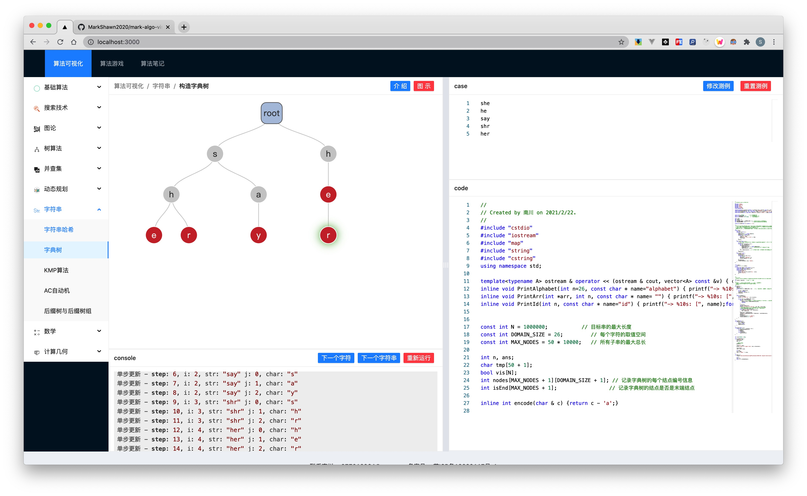

# 南川算法可视化

## 项目目标
致力于打造国内最好的算法可视化网站，普及算法知识，培养算法思维，提高算法能力。

## 项目展示


## 技术栈
### 整体框架
目前前端使用 next 框架，语言是 typescript。

### UI框架
antd 为主体，算法演示部分使用 E6、echarts 或者 d3。


## 算法清单

### 图论
#### 最短路径算法
- [ ] dijkstra
- [ ] Bellman-Ford
- [ ] SPFA
- [ ] floyd

### 红黑树

### 数论

## 加入项目
- 本项目是长期项目，欢迎 issue、pr、star与fork

## 联系我
- Email: 877210964@qq.com
- Wechat: MarkShawn2020
- 公众号：南川笔记

## Configure History
### typescript support
```
npm install --save-dev typescript
```

### antd support
> [Use in TypeScript - Ant Design](https://ant.design/docs/react/use-in-typescript)
```
yarn add antd
yarn create react-app antd-demo-ts --template typescript
npm install --save @ant-design/icons
npm install --save @antv/g6
```
### tailwindcss support
> [Install Tailwind CSS with Next.js - Tailwind CSS](https://tailwindcss.com/docs/guides/nextjs)
```
npm install -D tailwindcss@latest postcss@latest autoprefixer@latest
npx tailwindcss init -p
```

### any text file import support
> [Import .html or .txt files as strings? · Issue #2086 · vercel/next.js](https://github.com/vercel/next.js/issues/2086)
1. Install static file babel plugin:
```
npm install babel-plugin-static-fs --save-dev
```
2. Create a custom .babelrc file:
```text
{
  "plugins": ["babel-plugin-static-fs"],
  "presets": ["next/babel"]
}
```
3. Import your static files:
```js
import { readFileSync } from 'fs';
const text = readFileSync('path-to-file.txt', 'utf8');
```

### Resizer Bar Component Implementation
> thanks for: LeetCode-OpenSource/react-simple-resizer: 🐙 An intuitive React component set for multi-column resizing - https://github.com/LeetCode-OpenSource/react-simple-resizer

### Code typography
> - react-syntax-highlighter - npm - https://www.npmjs.com/package/react-syntax-highlighter
> - [react-syntax-highlighter/react-syntax-highlighter: syntax highlighting component for react with prismjs or highlightjs ast using inline styles](https://github.com/react-syntax-highlighter/react-syntax-highlighter#readme)
```shell
npm install react-syntax-highlighter --save
```
但是`react-syntax-highlighter`只支持渲染，不支持编辑，所以需要额外安装
```shell
npm i prismjs -S
npm install react-simple-code-editor
```
但是这个库并不好用。
换！
```shell
yarn add react-monaco-editor
```
最后历经千辛万苦，从`react-monaco-editor`换到`@monaco-editor/react`，还是在一个博客的评论下看到的，天呐，不用hack `webpack`还好用到哭，真是皇天不负有心人!
- [(17) How to Add Monaco Editor to a Next.js app - YouTube](https://www.youtube.com/watch?v=13UVFrGe80o)
- [How To Add Monaco Editor to a Next.js app - DEV Community](https://dev.to/swyx/how-to-add-monaco-editor-to-a-next-js-app-ha3)
- [@monaco-editor/react - npm](https://www.npmjs.com/package/@monaco-editor/react)


### Environment Variable Config
> - [Basic Features: Environment Variables | Next.js](https://nextjs.org/docs/basic-features/environment-variables)

attention: 环境变量默认不暴露给浏览器，如需浏览器使用，需要加前缀`NEXT_PUBLIC_` 

### 服务端数据加载与fs模块的使用（重要）
> - [Basic Features: Data Fetching | Next.js](https://nextjs.org/docs/basic-features/data-fetching)

注意，`getStaticProps`只能在`pages`下使用，而每个`page`又是一个网页，因此给我们的启示是在`pages`文件里使用一些变量的形式向组件传送数据

### Echarts + Jquery Support
```shell
npm i --save-dev @types/jquery
npm i @types/echarts
```
- echarts-react 只对react做了简单并偷懒的封装，比如说Option直接定义成了`any`，很不方便，对于tree option，应该用`"echarts/charts"`中的 `TreeSeriesOption`
- [echarts-for-react中数据发生变化，如何让图表实时更新。 - SegmentFault 思否](https://segmentfault.com/q/1010000017302705/a-1020000017857113)

解决了重新渲染echarts的bug（耗时一晚上，哭了）
    - [ECharts: Uncaught Error: `setOption` should not be called during main process_第一段代码的博客-CSDN博客](https://blog.csdn.net/godot06/article/details/109474771)

### typescript omit support
> - [typescript - Exclude property from type - Stack Overflow](https://stackoverflow.com/questions/48215950/exclude-property-from-type)

### 滑动底部
因为模拟了一个`terminal`输出，所以需要不断滚动到底部。

最佳解决方案是用`flex`，感谢这位回答
- [javascript - Keep overflow div scrolled to bottom unless user scrolls up - Stack Overflow](https://stackoverflow.com/questions/18614301/keep-overflow-div-scrolled-to-bottom-unless-user-scrolls-up)

