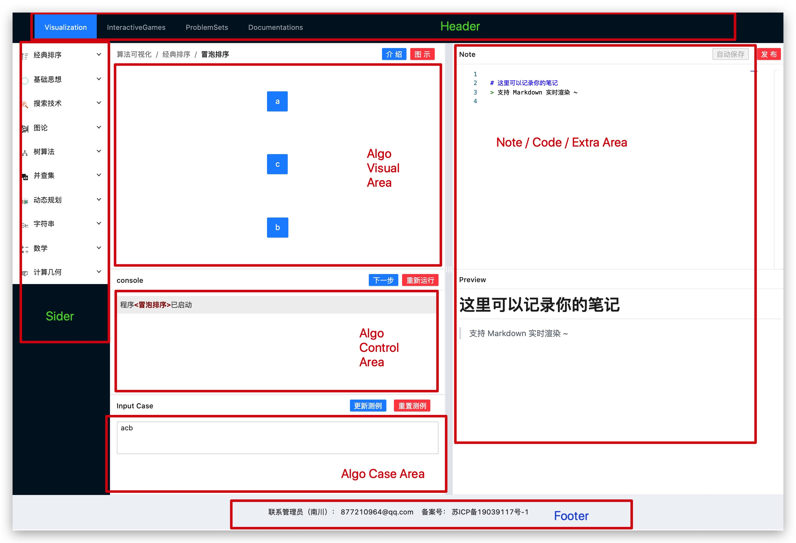
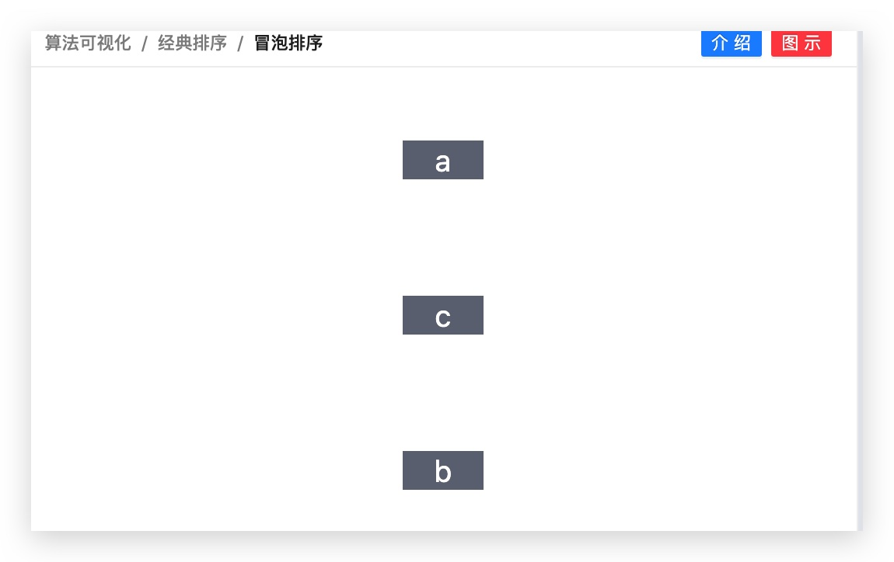

# 算法可视化组件开发指南一：入门介绍与设计理念

## 开发能力要求
开发一个可视化组件并不是十分困难的事情，尤其对于一些简单的算法来说，可能十分钟就可以搞定。

但您最好已经具备一定的`js`与`css`基础，对常用的`css`布局比如`flex`，和图表框架如`echarts`有一定的了解。

当然，最好的办法，就是跟随这份开发指南，看看一个组件是如何开发出来的。

算法可视化组件开发的主要依赖如下：
- antd：蚂蚁的UI框架，封装了布局、卡片、按钮等常用组件，用于全局布局与基本算法呈现
- echarts: Apache的图表框架（原百度），用于特定算法呈现，如树图可用于字典树的可视化等
- tailwindCSS: 精美的`postCSS`库，允许您使用最简短的术语为元素快速设置样式
- 其他

## 布局设计逻辑


在目前的版本中，算法可视化的呈现将位于`Algo Visual Area`，大小为`600px * 400px`。

所有的算法将联动操控从上到下的三块区域：`展示模块`、`控制输出模块`、`测例输入模块`。

## Demo 1: A Basic View of Bubble Sort Visualization
下面是我们的第一个例子，这段简短的代码，展示了开发一个算法可视化组件最重要的几个信息。


```typescript jsx
import React from "react";
import AlgoLayoutCore from "../../../../components/layout/AlgoLayout/AlgoLayoutCore";

const defaultCase = "acb";
const nav = ["算法可视化", "经典排序", "冒泡排序"];

export const AlgoBubbleSortRef = React.forwardRef((props, ref) => {
  return (
    <div className="w-full h-full flex flex-col justify-around items-center">
      {props.curCase.split("").map((item, index) => (
        <button className="w-16 bg-gray-500 text-white text-2xl" key={index}>
          {item}
        </button>
      ))}
    </div>
  );
});

export const AlgoBubbleSort = () => {
  return (
    <AlgoLayoutCore defaultCase={defaultCase} info={{ nav }}>
      <AlgoBubbleSortRef />
    </AlgoLayoutCore>
  );
};

export default AlgoBubbleSort;

```

### 测例输入与组件标识

首先，主要的输入有两个：`defaultCase`和`nav`，前者用于算法的测例初始化，后者用于导航，显然，这两个都是非常基础的。其中，导航后续可能会在字典或者数据库中配置，而无需在组件中定义。
```typescript jsx
const defaultCase = "acb";
const nav = ["算法可视化", "经典排序", "冒泡排序"];
```

### Component 与 Layout 之间的通信实现
接着，比较难理解的是`React.forwarRef`，这是`react`的高级内容，用于上下级组件之间的穿透。
```typescript jsx
export const AlgoNameRef = React.forwardRef((props, ref) => {
  return (
    <div>
      ...
    </div>
  )
})	
```
我已经做了足够严密的封装，所以您永远也无需知道这里面的原理与细节，除非您要重新设计一下我们的组件开发规范。所以，just copy and paste, it's all。

但对于爱好学习的你，可以参阅以下内容了解`ref`的细节：
- [Refs 转发 – React](https://zh-hans.reactjs.org/docs/forwarding-refs.html)
- [Hook API 索引 – React](https://zh-hans.reactjs.org/docs/hooks-reference.html#useimperativehandle)

此外，您可以浏览我们的代码实现部分，以深入理解本设计意图，从而更好地用于自己的开发：
`components/layout/AlgoLayout/AlgoLayoutCore.tsx`。


### CSS 与 tailwindCSS
```typescript jsx
<div className="w-full h-full flex flex-col justify-around items-center">
  ...
</div>
```
这一部分，是可视化呈现的内容部分，在`div`标签内`className`字段中，填写的是`tailwindCSS`样式，具体地解释如下：
```text
w-full: 	宽度占满父组件，即`width: 100%`
h-full: 	高度占满父组件，即`height: 100%`
flex:		启用`flex`布局，即`display: flex`
flex-col:	flex方向为竖直，即`flex-direction: column`
justify-around: flex的主轴排列为均匀分布（这样看起来美观）
items-center:	flex的次轴居中排列
```
这样，所有的`button`按钮（用于模拟元素），便是竖直居中了，详见下图。


在`button`中也有一些`tailwindCSS`的字段设置，都不难理解，对`tailwindCSS`感兴趣，欢迎访问
- [Documentation - Tailwind CSS](https://tailwindcss.com/docs)

当然，您也可以使用自己的`css`偏好，包括写`css`代码，虽然，这有点不那么"reacty"。

### JS 与 JSX 部分
```typescript jsx
{props.curCase.split("").map((item, index) => (
	<button className="w-16 bg-gray-500 text-white text-2xl" key={index}>
	  {item}
	</button>
  ))}
```
这里属于`jsx`领域，`props.curCase`是一个字符串，使用`split("")`后将切割为字符数组，然后再使用`map`函数将每个字符变成一个`button`。

区别于`vue`框架的`v-for`，在`react`中是完全基于`jsx`实现代码编写的。

此外，值得注意的是，由于`virtual DOM`的渲染机制，我们需要为循环遍历元素提供唯一的`id`，最简单的就是通过数组下标，虽然这可能不是特别推荐，但一般情况下够用了。如果我们的输入是`json`，则或许可以用数据中的一些关键字，比如`id`。

### 输出部分
```typescript jsx
export const AlgoBubbleSort = () => {
  return (
    <AlgoLayoutCore defaultCase={defaultCase} info={{ nav }}>
      <AlgoBubbleSortRef />
    </AlgoLayoutCore>
  );
};

export default AlgoBubbleSort;
```

最后是输出部分，由于封装，您直接`Ctrl + C`、`Ctrl + V`即可。

其中`AlgoLayoutCore`是算法可视化页面的整体布局，在其`children`位置填入`AlgoBubbleSortRef`后，会合并渲染`ref`内的信息。

最后的`export default`是不能少的，这是由于我们使用`nextjs`框架，在`pages`文件夹下的每个文件就是一个页面，`nextjs`对这些文件的要求是必须是一个待`default`输出的组件。

### 最后一点疑问
`props.curCase`是哪里来的？

我们下个`demo`再介绍，感谢您的阅读，祝您入门顺利~